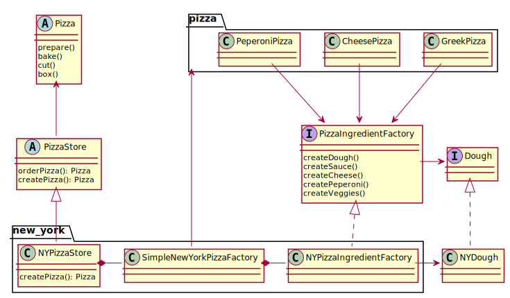

# Description
To create a group of related objects (here: dough, sauce, etc.) we
introduced an abstract (here: interface) PizzaIngredientFactory. A 
concrete factory implements this and can be used to create objects 
that should be used together. 

# Aditional Benefits
Objects belonging together can be created using the factory and
developers do not need to remember. It is, e.g., not possible to 
create a pizza with NY dough and Chicago sauce by mistake.

# Diagram

(all Pizzas still implement the Pizza interface. For readability 
this is not shown in the diagram, the chicago store looks similar 
to the new york one. There are also interfaces and concrete classes for other ny/chicago ingredients.
The pizza store does still apply the factory method for pizza 
creation)