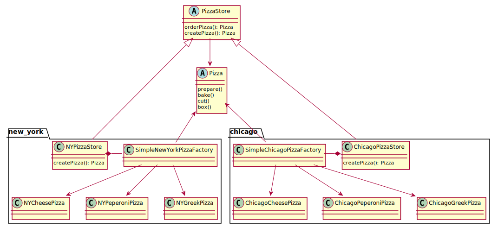

# Description
The PizzaStore became abstract now. The logic to be applied on Pizza 
is implemented, just the method to create a pizza is abstract. The
conrete stores (NY, Chicago) implement this method to create 
specific pizza instances.

# Aditional Benefits
Usage and implementation of pizzas are separated. The usage (logic applied) is the same for all pizzas in all stores. One doesn't need 
to remember which method needs to be called when.

# Diagram

(all Pizzas still implement the Pizza interface. For readability this is not shown in the diagram)