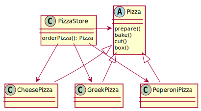

# Description
PizzaStore delivers pizzas. There are different implementations
of pizza which are instantiated by the store before logic is 
executed on them (prepare, bake, cut,box)

# Flaws
PizzaStore depends on all pizza implementations. Changing the menu 
is trouble, because the store has to be modified all the time (violates open-closed priniciple ;))

(Unit-)Testing is hard, because we cannot inject mock-pizzas easily.
(If you think this is still ok imagine a  more detailed scenario where you have ingredients, an oven, a storage, suppliers for the boxes etc...you wouldn't want to test all this together, would you?)

# Diagram
