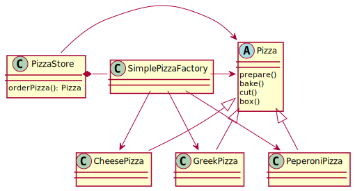

# Description
!This is **not** a factory pattern. Just good practice!
The creation of the pizzas is separated from the logic being
applied on them. The pizza-store doesn't depend on concrete
pizzas anymore since the logic applied is always the same. In 
other words, we separated what varies (pizza creation) from 
what stays the same (making the pizza). 
(The construct of the store only depending on the abstract pizza
and all concrete pizzas also depending on it the an example of the
famous Dependency Inversion)

# Benefits
Adding new pizzas does not require the store to be modified again.
Injecting a fake factory allows to test the store logic independent of any concrete pizza.

# Flaws
A second pizza store creating different pizzas would need to
either duplicate logic of the first or override the already 
implemented logic/method to create pizzas.
It could also create pizzas and run different logic (or in a 
wrong order) on them.

# Diagram
